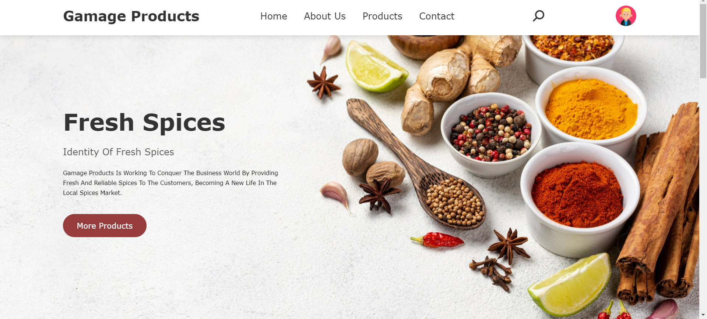
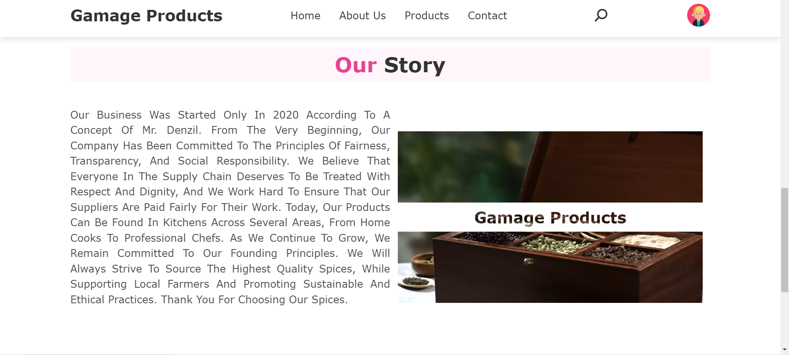
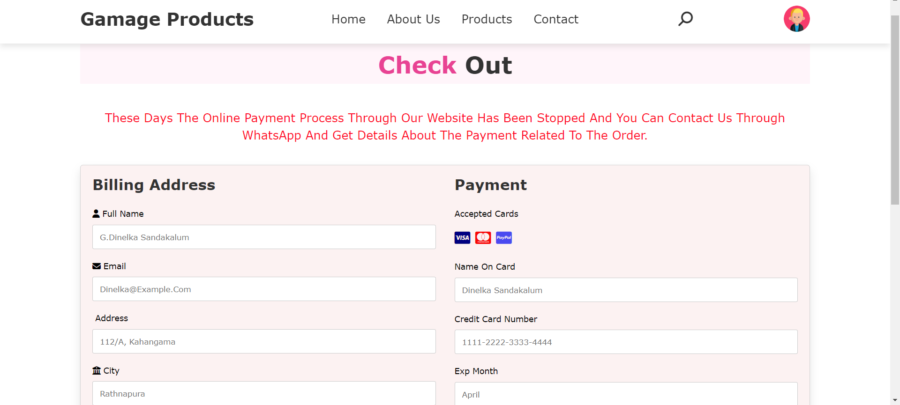
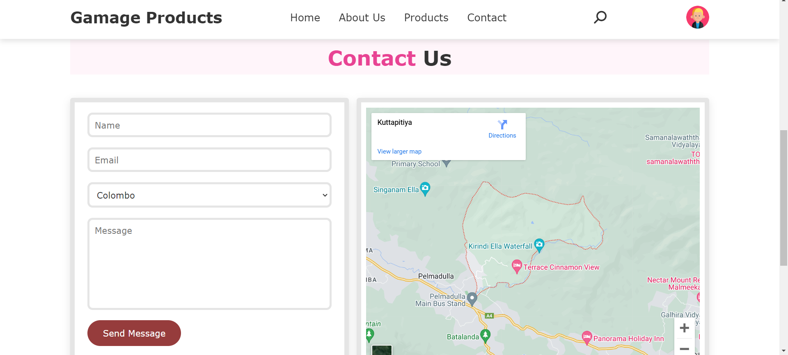

# 🌐 Gamage Product Website 

## 📝 Introduction

Gamage Product Website is a fully responsive e-commerce platform built using HTML, CSS, and PHP. It offers a seamless shopping experience through well-designed pages including Home, About, Product Categories, Contact, and Checkout. The site is optimized for all devices, ensuring a smooth and accessible interface for users, and enhancing both functionality and user experience.

## ⭐ Features

- **Responsive Design**: Compatible with desktops, tablets, and mobile devices.
- **Project Showcase**: Detailed descriptions and images of my projects.
- **Contact Form**: Visitors can get in touch with me directly through the website.
- **Smooth Navigation**: Easy-to-use navigation bar for seamless browsing.
- **Animations and Effects**: Subtle animations and hover effects for an interactive experience.

## 🔧 Technologies Used

- **HTML5**: For structuring the content.
- **CSS3**: For styling and responsive design.
- **PHP**: Backend support for the contact form.
- **Netlify**: Hosting the website.

## 📸 Screen Shot

### Home Section

### About Section

### Product Section

### Checkout Section

### Contact Section

